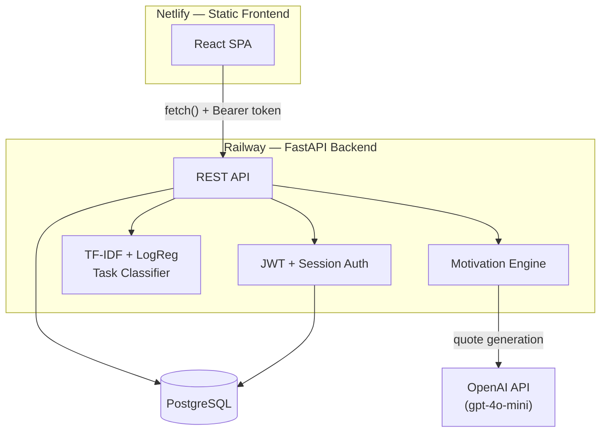

# Momentum

A full-stack student productivity app that unifies class schedules, tasks, projects, and extracurriculars into one dashboard — with an ML classifier that auto-categorizes tasks and an AI-assisted motivational quote system.

**Live app:** https://momentum-productivity-v1.netlify.app
**API:** https://momentum-production-c830.up.railway.app

> Built as a portfolio project to apply full-stack engineering, authentication design, and applied ML in one system — not a tutorial clone. Scope, tradeoffs, and what's deliberately deferred are documented at the bottom rather than hidden.

---

## Screenshots

<!-- TODO: replace with actual screenshots before sharing this README externally -->
| Login | Dashboard | Task Queue |
|---|---|---|
| _screenshot pending_ | _screenshot pending_ | _screenshot pending_ |

**Demo GIF:** _pending — will show register → add course → add task → see AI-predicted category → view on dashboard_

---

## Overview

Momentum lets a student register, add their courses/meetings/extracurriculars, and log tasks — then surfaces a single "today" view combining all of it on a timeline, plus a weekly schedule aggregation. Every task submitted gets run through a trained text classifier that predicts its category (academic / personal / health / social) before the user even picks one manually, with the prediction and confidence score persisted separately from the user's own choice — so the system can track how often the model agrees with the user.

A secondary feature layer generates rotating motivational quotes, mixing a curated static quote bank with live OpenAI-generated quotes, filtered against each user's recent quote history to avoid repeats and clichés.

## Features

- **Auth**: registration, login, logout, with server-side session tracking (not just stateless JWT) — sessions can be revoked independently of token expiry
- **Course / meeting / extracurricular management**: create and schedule recurring items by day-of-week, with active date ranges
- **Task & project management**: full CRUD, completion tracking, filtering by type/course/date
- **ML-powered task classification**: every task is auto-categorized on creation; predictions are logged and compared against user overrides
- **Aggregated views**: `/today` (single-day) and `/schedule/week` (7-day grid) combine courses, meetings, extracurriculars, and tasks into one response each
- **AI + static motivational quotes**: gender/degree-aware and class-difficulty-aware quote selection, with OpenAI fallback to a curated quote bank on API failure

## Tech Stack

| Layer | Technology |
|---|---|
| **Backend** | FastAPI, SQLAlchemy ORM, Pydantic v2 |
| **Auth** | PyJWT, passlib (bcrypt), server-side session table for revocation |
| **Database** | PostgreSQL (production, Railway) / SQLite (local dev) |
| **ML / NLP** | scikit-learn (TF-IDF + Logistic Regression), joblib for model persistence |
| **AI quotes** | OpenAI API (`gpt-4o-mini`), async client |
| **Frontend** | React 19, Vite, React Router v7 |
| **Testing** | pytest, FastAPI `TestClient`, in-memory SQLite test DB |
| **Deployment** | Railway (API + Postgres), Netlify (static frontend) |

## Architecture



Auth is **session-aware JWT**: a valid, unexpired JWT alone isn't sufficient — `get_current_user` also checks a `Session` row in the database to confirm the token hasn't been explicitly revoked (via `/logout`). This trades a small amount of statelessness for the ability to kill a session server-side, which a pure-JWT design can't do without a separate blocklist anyway.

## Machine Learning Component

Task type classification (`academic` / `personal` / `health` / `social`) is handled by a **TF-IDF + Logistic Regression** pipeline, trained in `notebooks/task_classifier_v1.ipynb`.

| Metric | Value |
|---|---|
| Dataset size | 260 labeled examples (hand-labeled, 4 balanced classes) |
| Vectorizer | TF-IDF, unigrams, `min_df=1` |
| Model | Logistic Regression (`C=0.5`) |
| Test accuracy | **65.38%** |
| Train accuracy | 98.08% |

The notebook documents the full iteration process — including a deliberate detour through `min_df=2` regularization that *lowered* test accuracy because it stripped low-frequency but disambiguating vocabulary (e.g. "dermatology," "concussion") that happened to matter for distinguishing `health` from `personal`. That's recorded as a finding, not hidden — the regularization intuition was right in general but wrong for this specific vocabulary-overlap problem.

The model is loaded once at API startup (`backend/classifier.py`) and called synchronously on every `POST /tasks/add`. Each prediction — type, subtype, confidence, model version — is persisted to a separate `NlpPrediction` table alongside a flag for whether the user overrode it, which is what would let a future iteration measure real-world model performance against user corrections rather than just held-out test accuracy.

**Documented next step, not yet built:** fine-tuning `distilbert-base-uncased` on the same labeled set and comparing accuracy against the TF-IDF baseline, swapping it in behind the same `classify()` interface. Scoped out to hit the deployment deadline — see Known Limitations.

## Getting Started

### Backend

```bash
git clone <repo-url>
cd momentum
python -m venv venv
source venv/bin/activate  # Windows: venv\Scripts\activate
pip install -r requirements.txt
```

Create a `.env` file in the repo root:

```
JWT_SECRET=<generate with: python -c "import secrets; print(secrets.token_hex(32))">
DATABASE_URL=sqlite:///./momentum.db
OPENAI_API_KEY=<your key>
```

```bash
uvicorn backend.main:app --reload
```

API available at `http://localhost:8000`, interactive docs at `http://localhost:8000/docs`.

### Frontend

```bash
cd frontend
npm install
```

Create `frontend/.env.local`:

```
VITE_API_BASE_URL=http://localhost:8000
```

```bash
npm run dev
```

### Tests

```bash
pytest
```

Runs the full suite against an in-memory SQLite database — auth, CRUD for every resource, schedule aggregation, motivation logic, and classifier integration.

## Known Limitations

Documented deliberately rather than left for a reviewer to discover:

- **DistilBERT upgrade not implemented.** The TF-IDF/LogReg classifier is the only model in production; the transformer fine-tuning step is scoped as a documented next iteration, not a hidden gap.
- **Test suite runs against SQLite only**, never Postgres. This became a real issue during deployment: a session-expiry datetime comparison worked locally under SQLite (which silently ignores `DateTime(timezone=True)` and stores naive datetimes) but threw `TypeError: can't compare offset-naive and offset-aware datetimes` against Postgres, which honors the timezone flag correctly. Fixed by switching to `datetime.now(timezone.utc)` throughout, but the test suite itself still can't catch this class of bug, since it never runs against a timezone-aware database.
- **Weekly schedule grid UI is not built** — the backend endpoint (`GET /schedule/week`) is complete and tested, but the frontend still only has the single-day dashboard view. The sidebar's "Week" link is currently inert.
- **No dedicated course/meeting/extracurricular management screen.** Creation works via a modal; listing, editing, and deactivating exist as backend endpoints but have no corresponding frontend UI yet.
- **Projects panel and a "Focus Score" widget are not implemented** — no real backend logic exists yet to power either meaningfully.
- **`priority_score` on tasks is an unused column.** No formula (deadline proximity, estimated hours, type weighting) has been implemented against it yet.

## What This Project Demonstrates

- Designing and implementing session-aware JWT authentication from scratch (not just "add a library")
- A full CRUD API surface across seven related resources with consistent auth guards, tested end-to-end
- Training, evaluating, and integrating a real (if intentionally simple) ML classifier into a live request path, with prediction logging for future evaluation
- Diagnosing an environment-specific production bug (SQLite vs. Postgres datetime handling) that only surfaced after deployment, not in local testing
- Deploying a two-service full-stack app (separate frontend/backend hosts) with correct CORS, environment-driven configuration, and SPA routing fallback

---

## License

This project is available for review as a portfolio piece. Not currently licensed for reuse.
